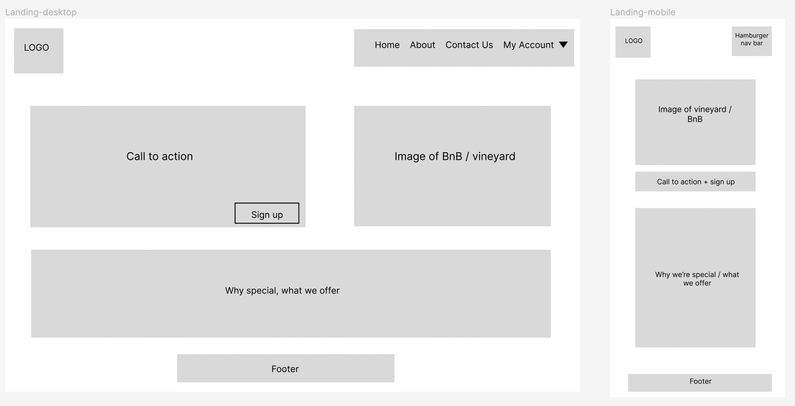
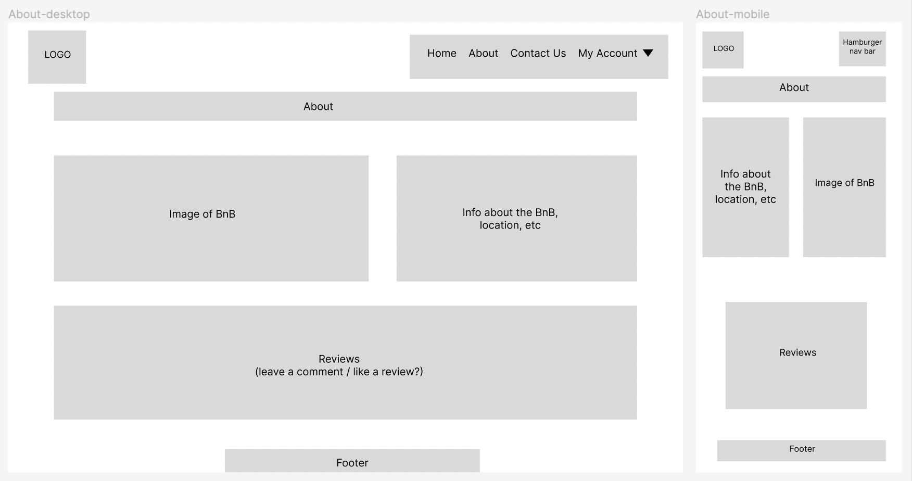
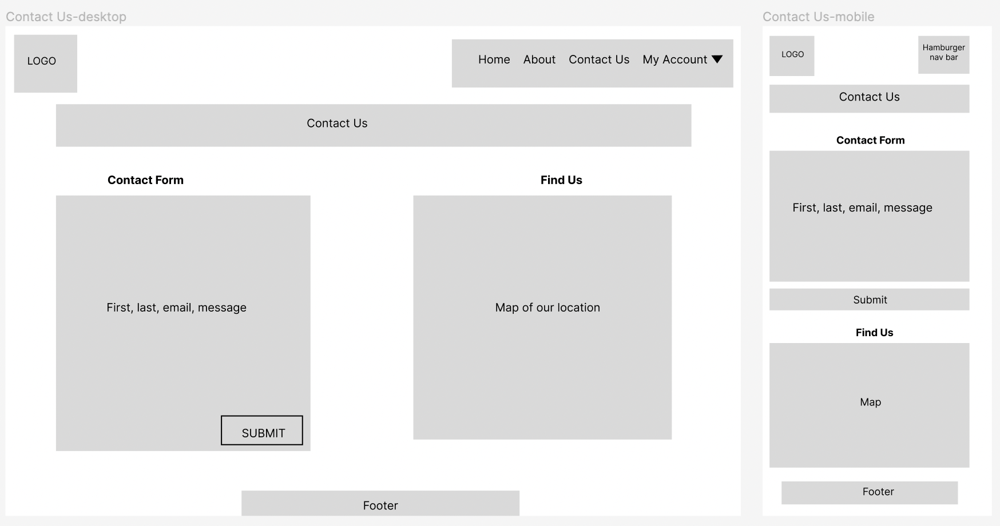
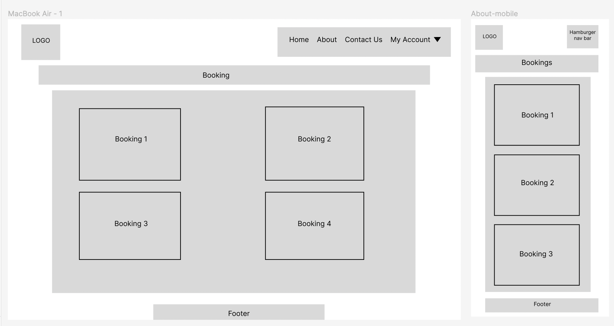
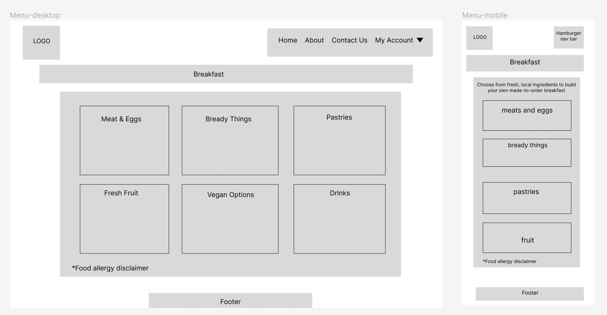
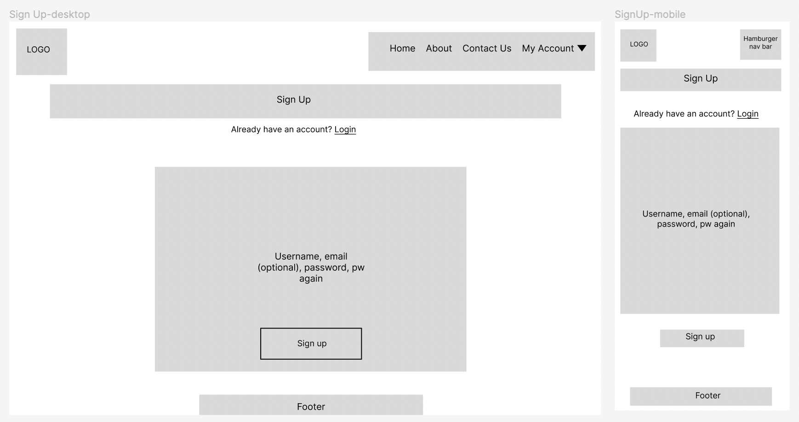
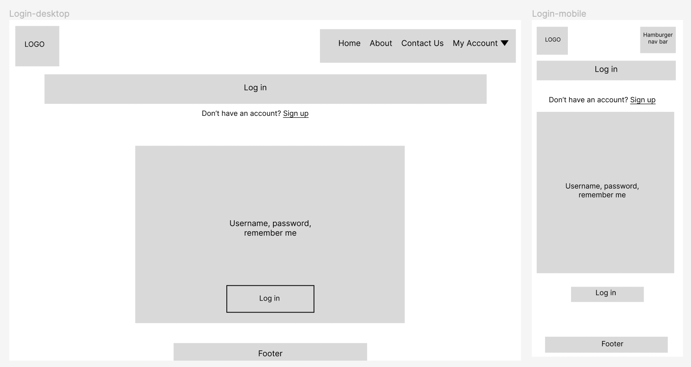
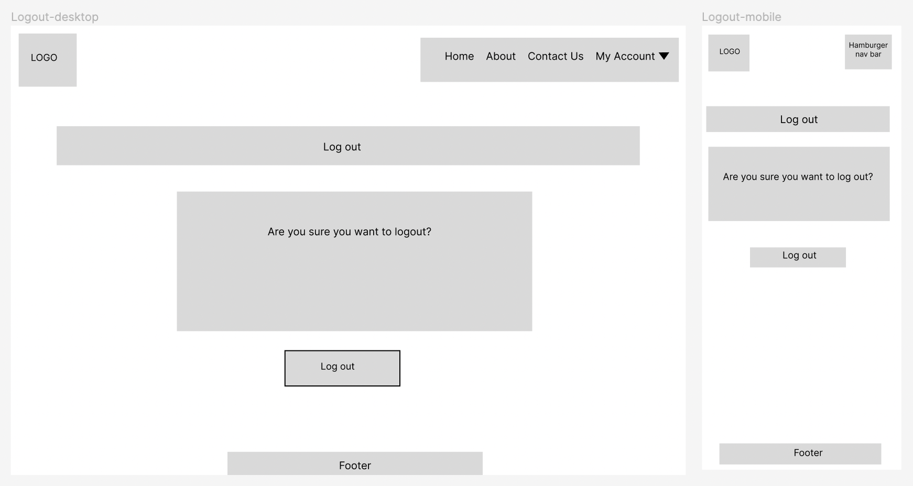

# The Wine Garden BnB

The Wine Garden BnB is a Bed & Breakfast website that gives users and potential guests a glimpse of the tranquility of staying at a BnB located in a picturesque Midwest vineyard.

The site is targets users wanting to spend a few days away from home but not necessarily in a cookie-cutter hotel. Visitors to the site can learn about the history of the BnB, view the amenities it offers, and book a room. Users can also contact us with any questions or comments.

A link to the live site can be found here - [The Wine Garden BnB](https://wine-garden-bnb.herokuapp.com/)

## Table of Contents
- [The Wine Garden BnB](#the-wine-garden-bnb)
  * [Table of Contents](#table-of-contents)
  * [User Experience (UX)](#user-experience--ux-)
    + [User Stories](#user-stories)
    + [EPIC | Project Environment Setup](#epic---project-environment-setup)
      - [User Stories](#user-stories-1)
    + [EPIC | Landing Page](#epic---landing-page)
      - [User Stories](#user-stories-2)
    + [EPIC | Initial Deployment](#epic---initial-deployment)
      - [User Stories](#user-stories-3)
    + [EPIC | Website Aesthetics](#epic---website-aesthetics)
      - [User Stories](#user-stories-4)
    + [EPIC | User Account](#epic---user-account)
      - [User Stories](#user-stories-5)
    + [EPIC | Site Administration & Booking](#epic---site-administration---booking)
      - [User Stories](#user-stories-6)
    + [EPIC | Testing & Documentation](#epic---testing---documentation)
      - [User Stories](#user-stories-7)
    + [EPIC | Error Pages](#epic---error-pages)
      - [User Stories](#user-stories-8)
    + [Design](#design)
      - [Color Scheme](#color-scheme)
      - [Imagery](#imagery)
      - [Fonts](#fonts)
      - [Wireframes](#wireframes)
  * [Agile Methodology](#agile-methodology)
  * [Data Model](#data-model)
  * [Testing](#testing)
  * [Database Design](#database-design)
  * [Security Features and Defensive Design](#security-features-and-defensive-design)
    + [User Authentication](#user-authentication)
    + [Form Validation](#form-validation)
    + [Database Security](#database-security)
    + [Custom error pages](#custom-error-pages)
  * [Features](#features)
    + [Header](#header)
    + [Footer](#footer)
    + [Home Page](#home-page)
    + [User Account Pages](#user-account-pages)
    + [About Page](#about-page)
    + [Menu Page](#menu-page)
    + [Contact Us Page](#contact-us-page)
    + [Book A Room](#book-a-room)
    + [My Bookings](#my-bookings)
    + [Edit A Booking](#edit-a-booking)
    + [Delete A Booking](#delete-a-booking)
    + [Error Pages](#error-pages)
    + [Future Features](#future-features)
  * [Deployment - Heroku](#deployment---heroku)
    + [Create a Heroku App:](#create-a-heroku-app-)
    + [Attach the Postgres database:](#attach-the-postgres-database-)
    + [Prepare the environment and settings.py file:](#prepare-the-environment-and-settingspy-file-)
    + [Create files / directories](#create-files---directories)
    + [Update Heroku Config Vars](#update-heroku-config-vars)
    + [Deploy](#deploy)
  * [Forking this repository](#forking-this-repository)
  * [Cloning this repository](#cloning-this-repository)
  * [Languages](#languages)
  * [Frameworks - Libraries - Programs Used](#frameworks---libraries---programs-used)
  * [Credits](#credits)
  * [Acknowledgments](#acknowledgments)

<small><i><a href='http://ecotrust-canada.github.io/markdown-toc/'>Table of contents generated with markdown-toc</a></i></small>

## User Experience (UX)

A visitor The Wine Garden BnB website would likely be an adult looking to spend time away but who would also want all the amenities of home. This website provides information about a family-run business that meets those needs.

### User Stories

### EPIC | Project Environment Setup
As the developer, I can create a new project so that I can develop the website.
#### User Stories
- As the developer, I can create a new project on GitHub so that I am ready to start developing the website.
- As the developer I can install Django and any other libraries needed so that I can start developing the website.
- As the developer, I will create an env.py file with secure variables so that sensitive information is kept unpublished publicly.
- As the developer, I can test the project locally so that I will be able to see any changes locally before pushing to GitHub / Heroku.

### EPIC | Landing Page 
As the developer, I can design a functional, easy-to-use landing page so that users can easily navigate through pages and use the site.
#### User Stories
- As a user, I can contact the developer through social links so that learn more about their work or get questions answered.
- As a user, I can use the website on all device sizes so that I can see the same information on small and large devices.
- As a user, I can use the navigation bar so that I can view all pages of the website easily

### EPIC | Initial Deployment
As the developer, I can deploy the app on Heroku so that users can view and interact with the site publicly.
#### User Stories
- As the developer I can deploy the app to Heroku so that I can ensure it works properly before heavily starting development on the site.
- As the developer, I can link the GitHub repository to the Heroku app so that when I commit changes on GitHub they are reflected on Heroku automatically.

### EPIC | Website Aesthetics
As the developer, I can design an aesthetically pleasing webpage so that users can easily navigate the site.
#### User Stories
- As the developer, I can use complimentary colors so that users can navigate the website easily.
- As a user, I can see the favicon on the web tab so that know I'm on the BnB page.
- As a user, I can click the logo of the website so that I can easily get back to the homepage.
- As the developer I can create wireframes so I can plan the layout of the website.

### EPIC | User Account
As the developer, I can create a register / login feature so users and create an account and login / logout.
#### User Stories
- As a user I can sign up, log in and log out so that I can see the features available to registered users.

### EPIC | Site Administration & Booking
As a site admin, I can manage all bookings and create, read, update and delete menu items so that I can control site bookings and the food / drink content.
#### User Stories
- As a user, I can create, read, update or delete food and drink items so that the menu is up to date.
- As a logged in user, I can click the 'booking' button so that I can easily view and manage my booking.

### EPIC | Testing & Documentation
As the developer, I can concisely document my testing and deployment methods so assessors and other developers can understand the website from a technical standpoint.
#### User Stories
- As the developer, I can create a README.md file so that other developers and the assessors can have an in-depth look at the website's structure and programming.
- As the developer, I can create a TESTING.md file so that the assessors can see the bugs and their solutions identified and the validation passed.
- As the developer, I can concisely describe the Heroku deployment process so that others know how to deploy an app on Heroku.

### EPIC | Error Pages
As the developer, I can create status error pages so users will know if there is a problem.
#### User Stories
- As the developer I can create a 500 error page so that users will know if there are internal server errors.
- As the developer I can create a 404 error page so that users will know when they've tried to access a page that doesn't exist.

### Design

The website design is set in simple, paragraph form, which is intended to make it easier for the reader to navigate. The navigation bar is clear on each page, as is the footer and the pages are labelled with a 'banner' format thus ensuring users know where they are at all times. 

The color scheme was chosen to reflect a 'red wine' color and incorporate rich, earthy tones to encompass the vineyard theme.

#### Color Scheme
The color palette was created using the palette generator [Coolers](https://coolors.co/).

The background of all site pages is the lightest color, a shade of beige, alowing for a stark contrast with the burgundy color when used as an accent. Shades of the green are used to accent other pages or as background for text or as a hover color. The darker beige color was used mainly as a visual cue to the user when links or buttons were hovered over.

All combinations of the colors used illustrate a contrast between background and text to ensure maximum user accessibility.

#### Imagery
Two different static images are included on the site depicting a homestead in a vineyard. Other images are used as the banner backgrounds on the About, Contact Us and Menu pages.
 

#### Fonts
The 'Quicksand' font is the main font used on the page, while 'Montserrat' in a bolder weight was used for the navbar and 'Kanit' for other accent areas. The 'Sans-serif' font is noted as a backup and will be used in the event that the main fonts aren't imported correctly to the site. These font style were chosen for their ease of legibility and general letter spacing and were imported from [Google Fonts](https://fonts.google.com/).

#### Wireframes

 
Landing Page

About

Contact Us

My Bookings

Menu

Sign Up

Login

Log out

## Agile Methodology

The agile methodology was used throughout project development. EPICS, user stories and the steps of the process are shown on [GitHub projects](https://github.com/users/Kaylaesmith1/projects/2/views/1).

In total, there were eight EPICs that encompassed all user stories, depending on subject matter. Each user story was created as an 'issue' that outlined the goal to implement and the acceptance criteria. Once these criteria were developed and met, the user story moved through the process to the 'done' column. When all user stories specfic to an EPIC were completed, the EPIC itself was moved to the 'done' column. 

Creating EPICs and user stories for this project facilitated a smooth working environment where both general and specific goals were visualized, more easily tackled and brought to fruition. 

## Data Model
I used principles of Object-Oriented Programming throughout this project and Django’s Class-Based Generic Views. Django AllAuth was used for user authentication.

The Customer model displays a working contact form on the Contact Us page. [Email js](https://www.emailjs.com/) was also used to ensure queries are addressed. For the purpose of this project, the emails arrive in my personal inbox.

A custom Menu model was made to incorporate CRUD functionality for admin superusers. This allows logged in, admin users to add, edit or delete a menu item, both from the live site and from the Django database via the Django admin page.

The Item model displays all menu items in the six chosen categories. The required fields are the name of the item, a slug field and a description.

The Room model has a list of the two rooms available to book, either the Master Bedroom or the Queen Bedroom. Logged in users can select one via a dropdown menu in the booking form on the Book A Room page.

The Booking model is for the user to select the room, check in and check out dates. They are unable to select the user on the form. Once the room is booked, the user is the logged in person by default.

## Testing

Details of all testing done can be viewed in depth in the [TESTING.md](https://github.com/Kaylaesmith1/bed-and-breakfast/blob/main/TESTING.md) document.

## Database Design
An Entity Relationship Diagram was created using [Figma](https://www.figma.com/) to better visualize the relationships of variables between data structures. 

Django-AllAuth was implemented for user authentication.

Models dealing with menu items allow the superuser all CRUD functionality.

Models dealing with booking a room use a ForeignKey for the user and room selection.

## Security Features and Defensive Design

### User Authentication

- Django's LoginRequiredMixin is used to ensure that any requests to access secure pages by non-authenticated or, in some cases, non-admin users, are redirected to the login page. 

### Form Validation
- All fields in the contact form are required. If a user attempts to submit the form without filling in all fields, a warning text will appear at the bottom of the form asking them to complete the fields. The form will not submit until all fields are filled in. Once this is done, a message will pop up that the form was submitted successfully.

### Database Security
The database url and secret key are stored in the env.py file to prevent unwanted connections to the database. The env.py file was created before the initial push to GitHub.

Cross-Site Request Forgery (CSRF) tokens were used on all forms throughout this site, barring the contact form.

### Custom error pages

Custom Error Pages were created to give the user more information on the error and to provide them with buttons to guide them back to the site.

- 404 Page Not Found - "Sorry! The page you're looking for doesn't exist. Click below to return to the homepage." Below, there is a clickable button that will take the user back to the home page.
- 500 Server Error - "Sorry! The Wine Garden BnB can't handle this request at the moment. Please return to the home page." Below this, there is a button that will take the user back to the home page.

## Features

### Header

**Logo**
- A customized logo was created using the free logo generator, [Hatchful](https://www.shopify.com/tools/logo-maker), by Shopify.
- The logo is positioned at the top left of the navigation bar. The logo is linked to the home page so the user can easily navigate the site.

**Navigation Bar**

- The navigation bar is present at the top of every page and includes all links to the other pages.
- The My Account navigation link is a drop down menu that includes the Sign up and Log in links. 

- When a user is logged in, the title changes to the user's name with a profile icon and the dropdown menu includes the Book A Room, My Bookings and Logout page links.

- The navigation bar is fully responsive and collapses into a hamburger menu icon on smaller screen sizes. collapsing into a hamburger menu when the screen size becomes too small. When the hamburger is clicked, the menu options open on the left-hand side just under the page logo.

- Hovering over the links will change the color to a light green.

### Footer
- The footer section includes working links to GitHub, Twitter, Instagram and Facebook. Clicking each link will open a separate browser page to the login of that website, barring the GitHub icon, which opens to my personal GitHub page.

- Hovering over the links will change the color to a light green, identical to the navbar. 

### Home Page

**Call to Action Section**
- The landing page includes a call to action section which encourages the user to book a room at The Wine Garden BnB. If the user is logged in, the message above the 'Book Now' button is, "Start planning your stay at The Wine Garden BnB". 

- If the user is not logged in, "Enjoy a relaxing stay and a glass of wine in the tranquility of a Midwest vineyard!" appears. Below, a 'Book Now' button is visible and will take the user to the login page where they can either log in or sign up to continue the booking process.

**Why a BnB Section**
- The "Why a bed and breakfast' section gives a brief overview of why users should choose a bed and breakfast over a 'cookie cutter' hotel experience. Under that, a few of the ammenities are listed in short paragraphs with three icons of the most important features The Wine Garden has to offer.

### User Account Pages

**Sign Up**

**Log In**

**Log Out**

- Django allauth was installed and used to create the Sign up, Log In and Log Out functionality and pages. 

- Success messages inform the user if they have logged in and logged out successfully and are present on the site for 3 seconds before automatically disappearing.

### About Page
**Get To Know Us Section**

- In this section there is an image of a cottage in a vineyard on the left and a 'Get to Know Us' section on the right describing the BnB and some of the features a person would find upon visiting.

**Customer Reviews Section**
- This is a static section that shows four customer reviews of The Wine Garden BnB.

### Menu Page
**Menu Section for non-authenticated and non-admin visitors**

- This page displays the breakfast banner and six categories of menu items. 
- Non logged in visitors and non-admin users will see a static page with items, they will not be able to add, edit, or delete items.

**Menu Section for admin users**

- The overall look of the page is the same. If a user is logged in as an Admin super user, they can add, edit and delete menu items.

- The 'Edit A Menu Item' appears with fields pre-filled in and the Admin user can change them and update the product card.

- If the Admin user chooses to delete a menu item, they are asked if they're sure they want to delete that specific menu item. Once they click the 'Delete Item' button, the item is deleted permanently from the live site and the Django database.

### Contact Us Page
The Contact Us page includes a Google Map of a winery in existence in Iowa. Given that The Wine Garden BnB is not a real place, a substitute, Summerset Winery, was used for the purpose of this project. 

- The page includes a contact form on the left-hand side that was implemented with [Email JS](https://www.emailjs.com/) and a Google Map on the right side.

- Filling out the contact form will send a message to my personal in box. The user is alerted both after successfully filling out and submitting the form and if they need to fill in a field. All fields are obligatory. The success or error messages stay for three seconds and disappear automatically.

### Book A Room

- The Book A Room page is visible only to authenticated, logged in users.
- The user fills out the form, selecting a room choice and the dates they want to book. 
- The dates are static by default to show the formatting and the user can change to different dates.
- Clicking 'Book Now' will take them to the My Bookings page where they will see their booking.

### My Bookings

- The My Bookings page shows the bookings of the logged in user.
- On each booking card, there are buttons to edit and delete the booking. 
- Users can only delete their own bookings.

### Edit A Booking

- The Edit Your Booking card shows the specific booking the user wants to edit with the fields pre-populated.
- They can change any of the fields and click 'Update' when finished.
- Clicking 'Update' will save their changes and revert them back to the My Bookings page where they will see a message saying their booking was updated correctly.
- The success message remains on the screen for three seconds before fading automatically. 

### Delete A Booking

- Logged in users can delete their own bookings by clicking the 'delete' button on the My Bookings page. 
- They will be taken to the Delete Your Booking page and asked if they're sure they want to delete this specific booking.
- Clicking 'Cancel' will revert them to the My Bookings page.
- Clicking 'Delete Booking' will delete that booking permanently and take them back to the My Bookings page where they will see a message saying their booking was deleted successfully and they will no longer see that booking.
- The success message remains on the screen for three seconds before fading automatically. 

### Error Pages

Custom Error Pages were created to give the user more information on the error and to guide them back to the site.

- 404 Page Not Found - Sorry! The page you're looking for doesn't exist. Click below to return to the homepage.

- 500 Server Error - Sorry! The Wine Garden BnB can't handle this request at the moment. Please return to the home page.

### Future Features
A few features were thought about mid-project as aspects that could improve the UI/UX but that were not implemented in this version of the project, either due to time contraints or simply because they were suggestions from friends / family members during the final testing phase of the project.

None were original user stories and were therefore not included anywhere in the project other than in this section. They are detailed below.

1. Email authentication for users on signing up. This would add another layer of authentication for users and would be an improvement on the overall website. 
2. Have something on the My Bookings page even if you don’t have any bookings registered. As of now it's a page titled 'My bookings' but nothing is shown.

3. Incorporate a payment option, rates and pricing for booking. This is normally a feature of online hotel booking platforms. Taking credit card information could be a helpful aspect to implement in the future.
4. Add photos of menu items or some food items on the breakfast page. Perhaps clicking the menu item could open a photo of it and a description of ingredients in case the user had questions of what exactly it was.
5. If a user cancels a booking, a pop up should appear with checkboxes as to why they cancelled. This could also be a form with a textarea field to be more specific.
6. Perhaps include a 'Book Now' button somewhere no each page of the website to facilitate easy booking.
7. The Admin user has access to all bookings from the live site. As of now, each user has access only to their bookings from the live website. It could be helpful for the Admin superuser to be able to access everyone's bookings and have CRUD functionality on them.

## Deployment - Heroku

The following steps were taken to deploy the live website to Heroku from the GitHub repository:

### Create a Heroku App:
- Log into your [Heroku](https://dashboard.heroku.com/apps) account or create an account.
- On the main page click the 'New' button at the top right corner and select 'Create New App' from the dropdown menu. 

- Enter in a unique app name
- Select your region
- Click 'Create App'

### Attach the Postgres database:
- In the Resources tab, under add-ons, type in Postgres and select the Heroku Postgres option.
- Copy the DATABASE_URL located in Config Vars in the Settings Tab.

### Prepare the environment and settings.py file:
- In your GitPod workspace, create an env.py file in the main directory.
- Add the DATABASE_URL value and your chosen SECRET_KEY value to the env.py file. 
- Update the settings.py file to import the env.py file and add the SECRETKEY and DATABASE_URL file paths.
- Comment out the default database configuration.
- Save all files and make migrations.
- Add the Cloudinary URL to env.py
- Add the Cloudinary libraries to the list of installed apps.
- Add the STATIC files settings - the url, storage path, directory path, root path, media url and default file storage path.
- Link the file to the templates directory in Heroku.
- Change the templates directory to TEMPLATES_DIR
- Add Heroku to the ALLOWED_HOSTS list the format ['app_name.heroku.com', 'localhost']

### Create files / directories
- Create a requirements.txt file
- Create directories in the main directory; media, static and templates.
- Create a "Procfile" in the main directory and add the following: web: gunicorn project_name.wsgi
- Make sure the Procfile is capitalized and only has one line.

### Update Heroku Config Vars
Add the following Config Vars in Heroku:
- SECRET_KEY value 
- CLOUDINARY_URL
- PORT = 8000
- DISABLE_COLLECTSTATIC = 1
- HEROKU_POSTGRESQL_OLIVE_URL value
- DATABASE_URL value

### Deploy
- Make sure DEBUG = False in the settings.py
- Go to the deploy tab on Heroku and connect to GitHub, then to the required repository. 
- Scroll to the bottom of the deploy page and either click Enable Automatic Deploys for automatic deploys or Deploy Branch to deploy manually. Manually deployed branches will need re-deploying each time the GitHub repository is updated.
- Click 'Open App' to view the deployed live site.

The site is now live and operational.
## Forking this repository
- Locate the repository at this link [The Wine Garden BnB](https://github.com/Kaylaesmith1/bed-and-breakfast).
- At the top of the repository, on the right side of the page, select "Fork" from the buttons available. 
- This creates a copy of the repository

## Cloning this repository
To clone this repository follow the below steps: 

1. Locate the repository at this link [The Wine Garden BnB](https://github.com/Kaylaesmith1/bed-and-breakfast). 
2. Under **'Code'**, see the different cloning options, HTTPS, SSH, and GitHub CLI. Click the prefered cloning option, and then copy the link provided. 
3. Open **Terminal**.
4. In Terminal, change the current working directory to the desired location of the cloned directory.
5. Type **'git clone'**, and then paste the URL previously copied from GitHub. 
6. Type **'Enter'** to create the local clone. 

## Languages

- Python
- HTML
- CSS
- Javascript

## Frameworks - Libraries - Programs Used 
- [Django](https://www.djangoproject.com/): Main python framework used in the development of this project
- [Django-allauth](https://django-allauth.readthedocs.io/en/latest/installation.html): Authentication library used to create user accounts
- [PostgreSQL](https://www.postgresql.org/) Used as the database for this project.
- [Heroku](https://dashboard.heroku.com/login) - Used as the cloud-based platform to deploy the site.
- [Am I Responsive](https://amiresponsive.co.uk/) - Used to verify responsiveness of website on different devices.
- [Figma](https://www.figma.com/) - Used to create wireframes for both desktop and mobile visuals.
- [Favicon](https://favicon.io/) - Used to create the wine glass icon for the browser tab.
- [Font Awesome](https://fontawesome.com/) - Used for icons on the home page and stars on the About page.
- [GitHub](https://github.com/) - Used for version control and agile methodology.
- [Google Fonts](https://fonts.google.com/) - Imported and used to change fonts on pages from default fonts.
- [W3C](https://www.w3.org/) - Used for HTML & CSS Validation.
- [PEP8 Online](https://pep8ci.herokuapp.com/#) - Used to validate all Python code pages in the project.
- [Jshint](https://jshint.com/) - Used to validate the JavaScript page.
- [Coolors](https://coolors.co/) - Used to create color scheme.
- [Crispy Forms](https://django-crispy-forms.readthedocs.io/en/latest/) Used to manage Django Forms
- [Cloudinary](https://cloudinary.com/): Used to upload all images used on the website.
- [Bootstrap](https://getbootstrap.com/docs/4.6/getting-started/introduction/): CSS used for developing responsiveness and styling the website.
- [Hatchful](https://hatchful.shopify.com/): Used to generate custom logo found on all pages.
- [Wondershare](https://www.wondershare.com/): Used to style aspects of the logo (remove background).
- [Canva](https://www.canva.com/): Used for page image banners (colored overlay and opacity)
- [Google](https://www.google.com/): All images used were sourced from a Google search.
- [EmailJS](https://www.emailjs.com/): Used to link the contact form to developer's personal email account.
- [Pixelied](https://pixelied.com/features/photo-filters/convert-image-to-black-and-white): Used to convert image to black and white before using a colored overlay for banners on pages.

## Credits

- [W3Schools](https://www.w3schools.com/)
- [Django Docs](https://docs.djangoproject.com/en/4.0/)
- [Bootstrap 4.6 Docs](https://getbootstrap.com/docs/4.6/getting-started/introduction/)
- [Stack Overflow](https://stackoverflow.com/)
- [Code Institute - Blog Walkthrough Project](https://github.com/Code-Institute-Solutions/Django3blog)
- [Ray's Bucktown](https://www.raysbucktownbandb.com/) - General layout and pages to include in the website. Banner idea on pages.
- [Victoria's Vineyard](https://www.victoriasvineyardbnb.com/index.html) - Content and description of vineyard and BnB in an Iowa town.
- [Grace Restaurant](https://github.com/GeorgianF/Grace-P4-CI) - Used as a template for menu features.
- [The Non-Dairy Godmother](https://github.com/Martiless/nondairy-godmother) - Repository used as a template for my own editing and deleting bookings.
- [YouTube Video for pop up messages](https://www.youtube.com/watch?v=lRrrLCrZDxI) - Used for contact form message pop ups on successful submission and errors.
- [YouTube Video for updating an item / booking](https://www.youtube.com/watch?v=EX6Tt-ZW0so) - Used as a guide to implement CRUD functionality.
- [YouTube Video for Django widget tweaks](https://www.youtube.com/watch?v=ynToND_xOAM) - implement widget tweaks in forms to add and edit menu items.
- [YouTube Video for booking logic](https://www.youtube.com/watch?v=m7uVhLxT1AA&list=PL_6Ho1hjJirn8WbY4xfVUAlcn51E4cSbY&index=3)

## Acknowledgments

Special thanks to the tutoring team, specifically Joshua who helped with the contact form, Sarah who helped with implementing CRUD functionality on the live site, and Oisin who helped fix the bug of being able to book a room under a different user.

Ian_alumni from the slack channel was vital to my understanding of the pathway followed for my delete buttons and getting them to work correctly. He spent time in a call with me clarifying the urls and views pathways. Thank you, Ian!

Lastly, thank you, too, to my mentor Harry for sharing his project and ideas about CRUD functionality. He gave clear, concise feedback on what needed to be fixed before project submission and complemented the work overall. 